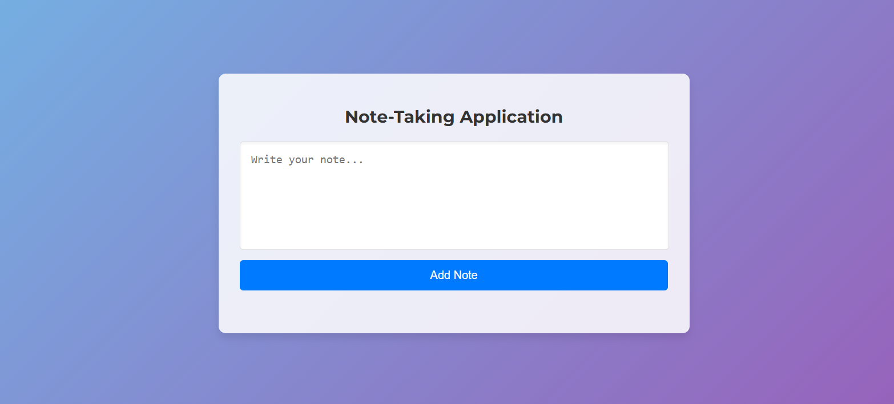

# Note-Making App

Welcome to the Note-Making App! This application allows you to create, edit, and delete notes seamlessly. It's built using modern web technologies like HTML, CSS, and JavaScript, with a backend powered by Node.js and Express.

## Features

- **Create Notes:** Write and save your notes with ease.
- **Edit Notes:** Update your notes anytime.
- **Delete Notes:** Remove notes that you no longer need.
- **Responsive Design:** Looks great on both desktop and mobile devices.

## Screenshots




## Getting Started

### Prerequisites

Make sure you have Node.js and npm installed on your system.

- [Node.js](https://nodejs.org/)
- [npm](https://www.npmjs.com/)

### Installation

1. Clone the repository:

    ```sh
    git clone https://github.com/meghanasrividya/Note-Making-App.git
    ```

2. Navigate to the project directory:

    ```sh
    cd Note-Making-App
    ```

3. Install the dependencies:

    ```sh
    npm install
    ```

### Running the App

1. Start the server:

    ```sh
    npm start
    ```

2. Open your browser and go to `http://localhost:3000` to see the app in action.

## Project Structure

```plaintext
Note-Making-App/
├── public/
│   ├── index.html
│   ├── styles.css
│   └── script.js
├── data.json
├── server.js
├── package.json
└── README.md
```

- **public/**: Contains the front-end files (HTML, CSS, JS).
- **data.json**: Stores the notes data.
- **server.js**: The main server file.
- **package.json**: Contains the project dependencies and scripts.
- **README.md**: Project documentation.

## API Endpoints

- **GET /api/notes**: Retrieve all notes.
- **POST /api/notes**: Create a new note.
- **PUT /api/notes/:id**: Update an existing note.
- **DELETE /api/notes/:id**: Delete a note.

## Technologies Used

- **Front-end**: HTML, CSS, JavaScript
- **Back-end**: Node.js, Express
- **Storage**: JSON file

## Contributing

Contributions are welcome! Please fork the repository and create a pull request with your changes.


## Contact

If you have any questions or suggestions, feel free to reach out:

- **GitHub**: [meghanasrividya](https://github.com/meghanasrividya)